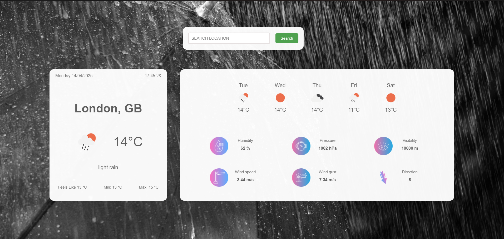

# Weather App

The Weather App is a React-based application that provides real-time weather information for cities around the world. Utilizing the OpenWeatherMap API and Google Maps API, this app allows users to search for a location and receive detailed weather forecasts, including temperature, humidity, wind speed, and more.

## Features

- **Real-Time Weather Data**: Get up-to-date weather information for any city.
- **Search Functionality**: Easily search for locations using the Google Places API.
- **Detailed Forecast**: View a 5-day weather forecast with daily temperature highs and lows.
- **Dynamic Backgrounds**: Experience changing backgrounds based on current weather conditions (e.g., clouds, rain, snow).
- **User-Friendly Interface**: Simple and intuitive design for easy navigation.

## Technologies Used

- **React**: For building the user interface.
- **OpenWeatherMap API**: To fetch weather data.
- **Google Maps API**: For location search and geocoding.
- **CSS**: For styling the application.

## Setup

1. Clone the repository.
2. Install dependencies using `npm install`.
3. Create a `.env` file with your API keys for OpenWeatherMap and Google Maps.
4. Run the app using `npm start`.

## Screenshots

